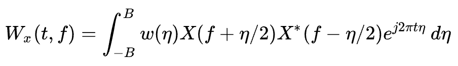
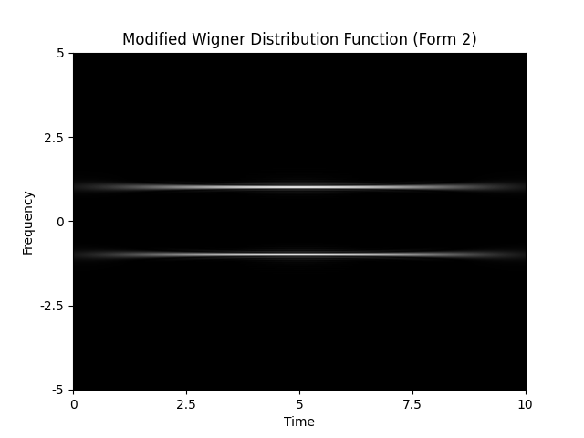

# Modified Wigner Distribution Function (Form II)

C++ implementation of Modified Wigner Distribution Function (Form II).

<p align="center"></p>

## Requirements

- CMake
- [FFTW](https://fftw.org/) version 3.3.10 (for 1D-FFT)
- [matplotlib-cpp](https://github.com/lava/matplotlib-cpp) (Download and save it in the `./include/` directory)
- Python, NumPy (for [matplotlib-cpp](https://github.com/lava/matplotlib-cpp))

## Usage

An example can be found in `./src/main.cpp`. Run it with the following commands.

```bash
mkdir build
cd build
cmake ..
cmake --build . --config Release
./mwdf
```

## Example

The WDF of $x(t) = \cos(2\pi t)$, using Gaussian window


